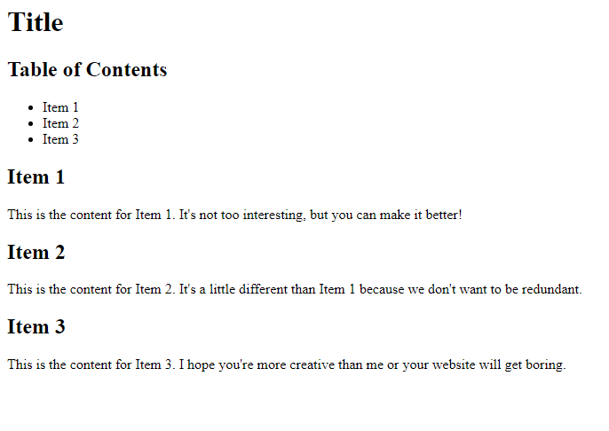
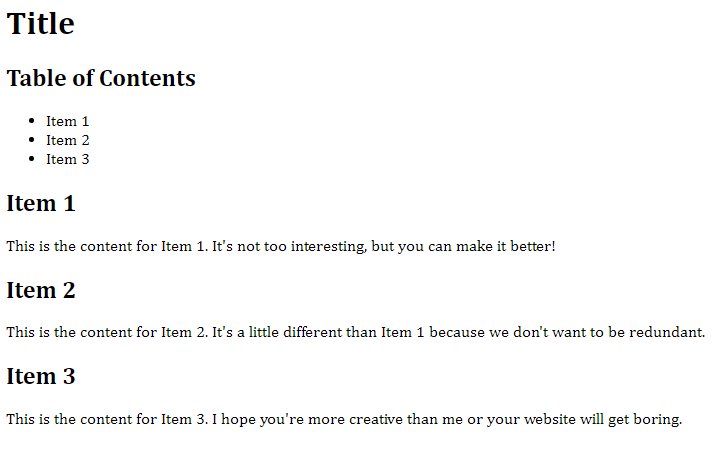
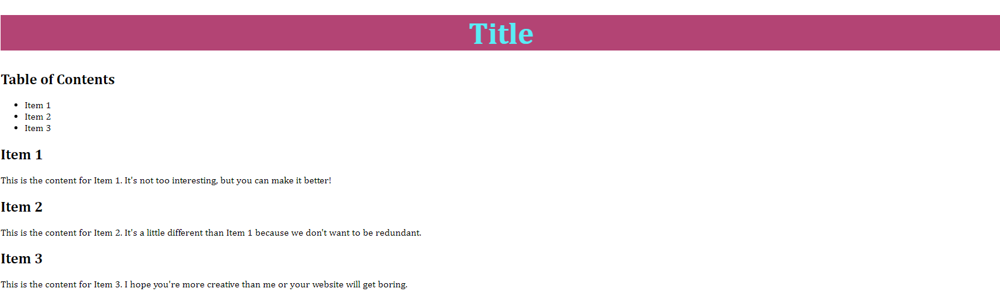

## About
Last Updated *[add date here]*   
Created by [OSU Maps and Spatial Data](https://info.library.okstate.edu/map-room)


## Table of Contents
- Introduction 
- *Creating a Website with HTML and CSS*
- - Getting Started
- - Adding Content
- - Adding Flare with CSS
- Conclusion
- Further Reading/Resources

## Introduction

## *[delicious content]*

#### Getting Started
1. To set up our website, we must first open a new code project. For this example I will be using Visual Studio Code.
2. In the first line, be sure to specify this project is and HTML project by using DOCTYPE html.
  ```html
  <!DOCTYPE html>
  ```
3. Next we will add a few tags. Be sure to include an html, head, style and body tag. This is a basic skeleton of a webpage.
  ```html 
  <html>
    <head>
        <style>
        </style>
    </head>
    <body>
    </body>
  </html>
  ```
4. If you open the project with a live server, you will see a blank page. We will add some content to make it a bit more interesting.

#### Adding Content
1. Let's start off by adding a header to the page. To do this, make sure that you are working within the *body* tag, which will contain all of the website's text. The tag for a header is *h1*. Within this tag, type what you want the header to be. 
  ```html
    <body>
      <h1>Title</h1>
    </body>
  ```
2. Be sure to save and check the live browser. You should now see your title. Don't worry if you don't like the appearance. We will go over how to format the website later.
  

  
3. Next, let's add a table of contents. For this, we will use the *ul*, or *unordered list*, tag. For each item within the list, add a *li* or *list item* tag.
  ```html
    <ul>
      <li>Item 1</li>
      <li>Item 2</li>
      <li>Item 3</li>
    </ul>
  ```
  

  
4. We should probably let people know that the list we just created is a table of contents and not just a random list. Let's add a header for it! Since we have already used the *h1* tag for our webpage's title, we will use the *h2* tag. Add it right above the list we created before. 
  ```html
    <h2>Table of Contents</h2>
  ```
  

  
5. Let's add some actual information to the page. To do this, let's start by adding the different sections we would like to include. For this example, I will keep using the *h2* tag, but you can change the heading size by using *h1* to *h6* to denote the degree of importance of each section. Name the sections according to the names you gave them in the *Table of Contents*.
```html
   <h2>Item 1</h2>
   <h2>Item 2</h2>
   <h2>Item 3</h2>
```
  
  ![Items[(images/Item.PNG)
  
6. To add text for each section use the *p*, or *paragraph*, tag. Add whatever text you please for each section.
  ```html
    <h2>Item 1</h2>
       <p>This is the content for Item 1. It's not too interesting, but you can make it better!</p>
    <h2>Item 2</h2>
       <p>This is the content for Item 2. It's a little different than Item 1 because we don't want to be redundant.</p>
    <h2>Item 3</h2>
       <p>This is the content for Item 3. I hope you're more creative than me or your website will get boring.</p>
  ```
  

  
#### Adding Flare with CSS
Now that we have the content for our website, we should make it more visually pleasing. To do so, we will be working within the *style* tag.
1. Let's stylize the main header first. In the *style* tag, type *h1 {}*. Within the curly brackets is where we will add our style elements.
  ```html
    body {}
  ```
2. Let's choose a font to use for the body of our webpage by using *font-family:*. You can choose different fonts than what I use and if you have trouble understanding what fonts to choose, the answer is just one Google search away!
  ```html
    body {
    font-family:Cambria, Cochin, Georgia, Times, 'Times New Roman', serif
  }
  ```



3. Now we'll create a really cool header for our webpage! Just add an *h1* section to the *style* tag like we did for the body. We should change the color of the text, the text alignment and font size. While we're at it, we might as well add a background color too!
  ```html
    h1 {
      color: rgb(52, 234, 247);
      text-align: center;
      font-size: 50px;
      background-color: rgb(185, 72, 116);
    }
  ```
  
  
  
4. While this looks cool, it's not exactly what I want. I imagined the header would be thicker. To creater a thicker header, just add some padding!
  ```html
    h1 {
      color: rgb(52, 234, 247);
      text-align: center;
      font-size: 50px;
      background-color: rgb(185, 72, 116);
      padding: 50px;
    }
  ```


## Conclusion

## Further Reading/Resources


[Return to Top](#about)
