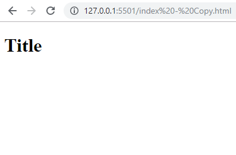
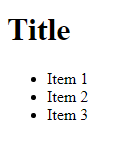
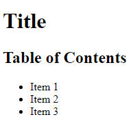

## About
Last Updated *[add date here]*   
Created by [OSU Maps and Spatial Data](https://info.library.okstate.edu/map-room)


## Table of Contents
- Introduction 
- *Creating a Website with HTML and CSS*
- - Getting Started
- - Adding Content
- Conclusion
- Further Reading/Resources

## Introduction

## *[delicious content]*

#### Getting Started
1. To set up our website, we must first open a new code project. For this example I will be using Visual Studio Code.
2. In the first line, be sure to specify this project is and HTML project by using DOCTYPE html.
  ```html
  <!DOCTYPE html>
  ```
  3. Next we will add a few tags. Be sure to include an html, head, style and body tag. This is a basic skeleton of a webpage.
  ```html 
  <html>
    <head>
        <style>
        </style>
    </head>
    <body>
    </body>
  </html>
  ```
  4. If you open the project with a live server, you will see a blank page. We will add some content to make it a bit more interesting.

#### Adding Content
1. Let's start off by adding a header to the page. To do this, make sure that you are working within the *body* tag. The tag for a header is h1. Within this tag, type what you want the header to be. 
  ```html
    <body>
            <h1>Title</h1>
    </body>
  ```
  2. Be sure to save and check the live browser. You should now see your title. Don't worry if you don't like the appearance. We will go over how to format the website later.
  
  
  
  3. Next, let's add a table of contents. For this, we will use the *ul*, or *unordered list* tag. For each item within the list, add a *li* or *list item* tag.
  ```html
    <ul>
      <li>Item 1</li>
      <li>Item 2</li>
      <li>Item 3</li>
    </ul>
  ```
  
  
  
  4. We should probably let people know that the list we just created is a table of contents and not just a random list. Let's add a header for it! Since we have already used the *h1* tag for our webpage's title, we will use the *h2* tag. Add it right above the list we created before. 
  ```html
    <h2>Table of Contents</h2>
  ```
  
  

## Conclusion

## Further Reading/Resources


[Return to Top](#about)
